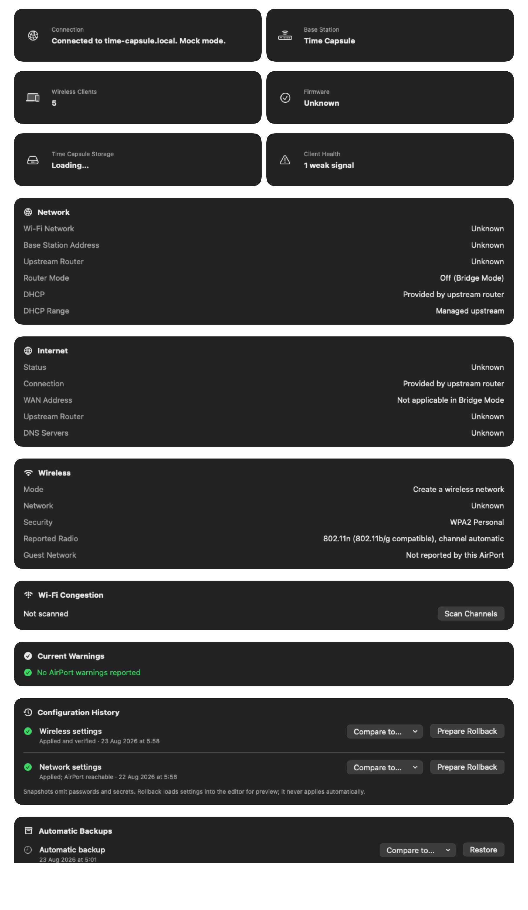

# AirPort Utility Pro

A modern macOS utility for configuring, monitoring, and diagnosing Apple AirPort
base stations and Time Capsules. The SwiftUI app uses a reverse-engineered Python
backend and is intended to keep this hardware useful on current and future macOS
releases.

> [!WARNING]
> This project is beta software built on an unofficial, reverse-engineered
> protocol. Back up important configurations and use write operations carefully.

[Download version 0.1.0 beta 4](https://github.com/pepperstm/airport-utility/releases/tag/v0.1.0-beta.4)
· [Report a bug](https://github.com/pepperstm/airport-utility/issues)
· [Security policy](SECURITY.md)




## What's new since the original reimplementation

This project started as a focused reimplementation of Apple's AirPort Utility:
discover a base station, view its network map, and edit the same settings
panes the original app offered. Everything below has been added since:

- **Dashboard** — a single-screen overview of a selected AirPort: network and
  Internet summary, wireless status, current warnings, connected clients,
  and (for Time Capsules) storage and backup health, alongside the original
  per-setting configuration panes.
- **Wi-Fi congestion analysis** — an on-demand scan of nearby wireless
  networks with advisory channel recommendations ([details](docs/wifi-congestion.md)).
- **Time Capsule storage and backup health** — disk capacity, SMART status,
  SMB reachability, and Time Machine sparsebundle growth/backup-freshness
  analysis, all read-only ([details](docs/backup-history.md)).
- **Health history and trend charts** — a small local history of health
  measurements so the Dashboard can show change over time, not just the
  latest reading ([details](docs/health-history.md)).
- **Configuration snapshots, history, and reviewed rollback** — every
  settings write is snapshotted first and its outcome recorded, so a
  previous configuration can be reviewed and restored later
  ([details](docs/configuration-history.md)).
- **Hardware compatibility reporting** — Diagnostics shows whether a
  connected AirPort's product identifier matches a profile the app
  recognises, and includes that assessment in exported support bundles
  ([details](docs/hardware-compatibility.md)).
- **Network diagnostics** — four read-only checks (gateway, DNS,
  public-Internet reachability, and likely double-NAT) run from the Mac
  itself, independent of what the AirPort reports about itself
  ([details](docs/network-diagnostics.md)).
- **Structured, redacted logging and exportable diagnostics bundles** — a
  searchable in-app log viewer and one-click support-bundle export, with
  credentials and hardware addresses redacted before anything is written
  to disk.
- **A guided setup wizard** — for a factory-reset or unconfigured AirPort:
  create a new network, extend an existing one, or replace another device,
  with a recommendation, a review-before-apply step, and a completion screen.
- **Self-contained packaging** — the Python backend now ships frozen inside
  the app; a system `python3` is no longer required to run the packaged
  release, only to build it from source
  ([ADR-0001](docs/architecture/ADR-0001-self-contained-backend-runtime.md)).
- **Client identification** — a vendor name (from a curated, real IEEE OUI
  lookup, never a guess), a conservatively-guessed device type, and an
  optional local nickname for each connected client
  ([details](docs/client-identification.md)).
- **Automatic configuration backups** — a credential-free settings snapshot
  saved about once a day while connected, independent of any change you
  make, so a recent backup exists before a firmware upgrade or factory reset
  ([details](docs/automatic-backups.md)).
- **Sites** — save a named connection (Home, Office, a parents' house) and
  switch back to it later, instead of waiting for Bonjour to rediscover it
  or retyping its address ([details](docs/sites.md)).
- **Recovery mode** — a guided next step when a restart, firmware install,
  or configuration write doesn't come back cleanly, with a direct path to
  restore the most recent known-good settings
  ([details](docs/recovery-mode.md)).
- **Compare to Current** — see exactly what a Configuration History or
  Automatic Backup entry would change, field by field, before deciding
  whether to restore it — against the current settings, or against any
  other visible entry ([details](docs/settings-diff.md)).

Client names and addresses appear only when the AirPort or local discovery
services report them. Vendor and device-type guesses are conservative by
design — an unclear signal is reported as unknown, never invented. Local
nicknames are an explicit exception you create yourself, stored only on
this Mac; the app does not otherwise infer or fabricate device identities.

## Feature documentation

Each of the major features above has its own write-up covering exactly what
data it uses, what's read-only versus configurable, and any privacy or
retention details:

- [Health history and trend charts](docs/health-history.md)
- [Time Machine backup-history analysis](docs/backup-history.md)
- [Network diagnostics](docs/network-diagnostics.md)
- [Wi-Fi congestion analysis](docs/wifi-congestion.md)
- [Configuration history and reviewed rollback](docs/configuration-history.md)
- [Hardware compatibility reporting](docs/hardware-compatibility.md)
- [Client identification](docs/client-identification.md)
- [Automatic configuration backups](docs/automatic-backups.md)
- [Sites](docs/sites.md)
- [Recovery mode](docs/recovery-mode.md)
- [Compare to Current](docs/settings-diff.md)

## Using the app

### Connecting to an AirPort

The **Network Map** view discovers AirPort base stations and Time Capsules on
the local network via Bonjour and draws them as a topology — which device is
uplinked to which, and what's connected downstream of each. Selecting a
device opens its **Dashboard**. An "Other Wi-Fi Devices" menu lists nearby
wireless networks that aren't part of the discovered topology (useful when a
base station is in bridge mode or otherwise not advertising itself the same
way).

Use **Sites…** (File menu) to save a named connection — Home, Office, a
parents' house — and switch back to it later instead of waiting for Bonjour
to rediscover it or retyping its address ([details](docs/sites.md)).

If a base station hasn't been set up yet, selecting it starts the **setup
wizard** instead of the Dashboard: choose whether to create a new network,
extend an existing one, or replace another device, review a recommended
configuration, adjust the details that matter (network name, password,
Wi-Fi band, etc.), then apply. A completion screen confirms the base station
is reachable with the new configuration before handing you off to its
Dashboard.

### The Dashboard

The Dashboard is the default view for an already-configured AirPort. Each
section reflects one read-only aspect of the device's current state:

- **Network** and **Internet** — a summary of the router mode and WAN
  connection type, without needing to open the full configuration panes.
- **Wireless** — the current Wi-Fi network name, band, and mode (create/
  join/extend).
- **Wi-Fi Congestion** — run an on-demand scan of nearby networks for a
  channel recommendation; nothing scans automatically or in the background.
- **Recovery** — appears only when a restart, firmware install, or
  configuration write didn't come back cleanly, with a direct path to
  restore the most recent known-good settings — see
  [recovery-mode.md](docs/recovery-mode.md).
- **Current Warnings** — anything the AirPort itself is reporting as a
  problem (e.g. a disconnected WAN, a failed disk).
- **Configuration History** — a log of past settings writes, whether each
  one completed and left the device reachable, with the option to compare
  an earlier snapshot to the current settings or restore it — see
  [settings-diff.md](docs/settings-diff.md).
- **Automatic Backups** — a standing settings snapshot saved about once a
  day regardless of whether you change anything, with the same
  compare/restore options as Configuration History — see
  [automatic-backups.md](docs/automatic-backups.md).
- **Connected Clients** — devices currently associated with this AirPort,
  named only when the AirPort or local discovery actually reports a name,
  with a vendor name, a conservatively-guessed device type, and an optional
  local nickname (right-click a client to rename it) — see
  [client-identification.md](docs/client-identification.md).
- **Health History** — a small local trend chart built from periodic
  observations of this device (see [health-history.md](docs/health-history.md)
  for exactly what's recorded and for how long).
- **Storage** and **Time Machine Backup** (Time Capsules only) — disk
  capacity, SMART status, SMB reachability, and sparsebundle growth/backup
  freshness.

### Changing settings

The configuration panes — **Base Station**, **Network**, **Internet**,
**Wireless**, **AirPlay**, **Firmware**, **Disks**, and **Advanced** — mirror
the original AirPort Utility's settings screens. Editing a field stages a
change; nothing is sent to the device until you choose **Preview**, which
shows exactly what will be sent, followed by **Apply**. Every apply is
snapshotted first (see Configuration History above) so a change that leaves
the AirPort unreachable or misconfigured can be reviewed and rolled back.

Disk actions (erase, archive) and firmware uploads ask for an explicit
confirmation beyond Preview/Apply, since they're destructive or
device-rebooting operations respectively.

### Diagnostics and support bundles

The **Diagnostics** pane has three parts:

- **Network diagnostics** — gateway reachability, DNS resolution, public-
  Internet reachability, and a heuristic for detecting a likely double-NAT
  setup, run from the Mac rather than asked of the AirPort
  ([method](docs/network-diagnostics.md)).
- **Log viewer** — a searchable, filterable view of the app's own
  structured logs (by level and category), with credentials and hardware
  addresses redacted at write time, not just at display time.
- **Support bundle export** — packages redacted logs, diagnostics results,
  and (if applicable) a hardware-compatibility assessment into a single
  file suitable for attaching to a bug report.

## Install the beta

Download the macOS ZIP from the
[releases page](https://github.com/pepperstm/airport-utility/releases), unzip it,
and move **AirPort Utility.app** to Applications.

The beta is ad-hoc signed rather than notarized. On first launch, macOS may
require you to Control-click the app, choose **Open**, and confirm. The packaged
app requires:

- macOS 13 or newer, Apple Silicon
- Network access to the AirPort and its administrator password

The Python backend ships as a self-contained executable inside the app
(see [ADR-0001](docs/architecture/ADR-0001-self-contained-backend-runtime.md)) —
no system `python3` is required to run the packaged app. Python is only a
build-time requirement (see below).

## Build from source

Install Xcode 16 or newer, or the matching Command Line Tools, then confirm that
Swift 6 and Python 3.10 or newer are available:

```sh
xcode-select --install
swift --version
python3 --version
```

Clone the repository and run:

```sh
./run.sh
```

No third-party Swift packages are required; `python3` is used unmodified as a
subprocess interpreter for this source-checkout dev flow. To create an ad-hoc
signed standalone app containing the backend (this freezes the backend into a
self-contained executable — see ADR-0001 — and needs network access to
install PyInstaller into a disposable build-time venv):

```sh
./build-app.sh --smoke-test
```

The result is written to `.build/release-app/AirPort Utility.app`. Set release
metadata with, for example,
`VERSION=0.2.0 BUILD_NUMBER=40 ./build-app.sh`.

## Test

```sh
swift test
python3 -m unittest Tests/BackendPythonTests/test_backend_modules.py
```

Slower subprocess tests are opt-in:

```sh
AIRPORT_UTILITY_SLOW_TESTS=1 swift test
```

Live-device tests run only when their individual `AIRPORT_LIVE_*` flags are set.
They can change network, password, disk, or firmware settings on real hardware;
normal development and CI do not require them.

## Privacy and diagnostics

Passwords are stored in the macOS Keychain when requested. Logs and support
bundles redact credentials and hardware addresses, but should still be reviewed
before sharing because network diagnostics may contain environment-specific
details.

Health history stays on the Mac and contains aggregate observations rather than
client identities. Samples are consolidated into 15-minute windows and retained
for up to 90 days, with a global limit of 2,000 records. See
[Health history and trend charts](docs/health-history.md) for the exact data,
retention, storage location, interpretation, and removal behavior.

## Hardware coverage

Testing cannot cover every model, firmware version, network mode, or legacy
feature. PPPoE in particular has limited real-hardware coverage.

| Name | Model | ACP | Device-specific features |
| --- | --- | --- | --- |
| AirPort Express | A1088 | v1 | AirPlay |
| AirPort Express | A1392 | v2 | AirPlay |
| AirPort Extreme | A1034 | v1 | Modem; no NAS |
| AirPort Extreme | A1354 | v2 | NAS |
| AirPort Extreme | A1521 | v2 | NAS |
| Time Capsule | A1254 | v2 | NAS; internal disk |
| Time Capsule | A1470 | v2 | NAS; internal disk |

Other models may work partially. Please include the model, firmware version,
macOS version, and sanitized diagnostics when reporting compatibility issues.

## Project documentation

See [Feature documentation](#feature-documentation) above for how each
major feature works. The rest of the project's documentation:

- [Product roadmap](docs/product/ROADMAP.md)
- [Application foundation and safety boundary](docs/architecture/FOUNDATION.md)
- [Security and responsible testing](SECURITY.md)
- [Known issues](docs/known-issues.md)
- [ADR-0001: removing the external `python3` dependency](docs/architecture/ADR-0001-self-contained-backend-runtime.md)
- [Nested code-signing inventory](docs/architecture/nested-code-signing-inventory.md)
- [Hardened runtime entitlements (draft)](docs/architecture/hardened-runtime-entitlements.md)
- [Clean-Mac verification procedure](docs/release/clean-mac-verification.md)
- [Apple credentials needed for notarisation](docs/release/apple-credentials-needed.md)

## Licence

This project is dual-licensed. Most of the codebase is released under the
[MIT License](LICENSE); a specific set of files that are new work by Graham
Barber are separately released under [GPLv3](COPYING) instead, each marked
with an `SPDX-License-Identifier` header. See [`NOTICE.md`](NOTICE.md) for
the full explanation and file list. Apple, AirPort, Time Capsule, macOS, and
Time Machine are trademarks of Apple Inc. This project is independent and is
not affiliated with or endorsed by Apple.
