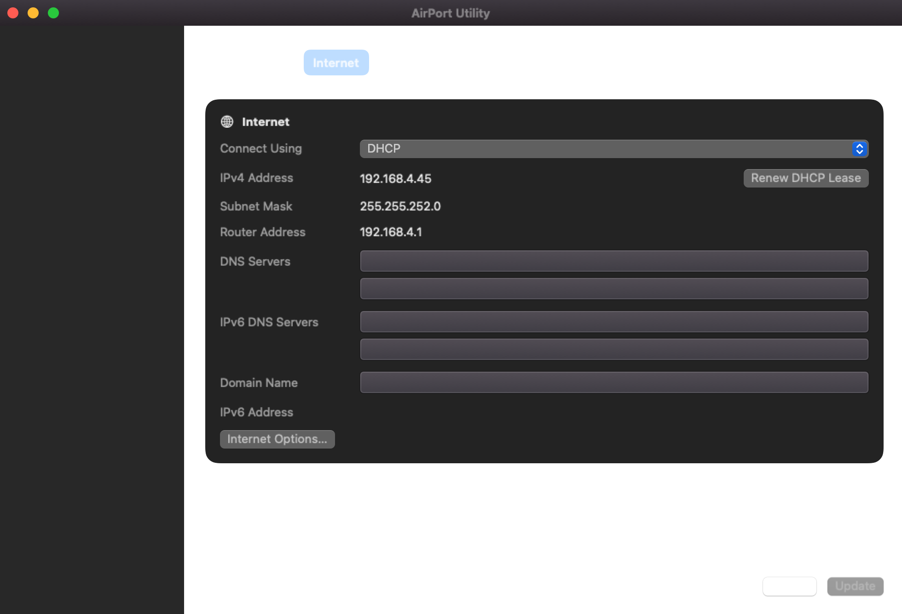

# AirPort Utility Pro

A modern macOS utility for configuring, monitoring, and diagnosing Apple AirPort
base stations and Time Capsules. The SwiftUI app uses a reverse-engineered Python
backend and is intended to keep this hardware useful on current and future macOS
releases.

> [!WARNING]
> This project is beta software built on an unofficial, reverse-engineered
> protocol. Back up important configurations and use write operations carefully.

[Download version 0.1.0 beta 1](https://github.com/pepperstm/airport-utility/releases/tag/v0.1.0-beta.1)
· [Report a bug](https://github.com/pepperstm/airport-utility/issues)
· [Security policy](SECURITY.md)




## Features

- AirPort discovery, topology, automatic upstream selection, and configuration
- Internet, network, wireless, firmware, disk, and connected-client dashboards
- Time Capsule capacity, SMART status, SMB reachability, and backup freshness
- Local health notifications and privacy-conscious historical trend charts
- Structured redacted diagnostics and exportable support bundles
- Preview and confirmation workflows around supported configuration changes

Client names and addresses appear only when the AirPort or local discovery
services report them. The app does not infer or fabricate device identities.

## Install the beta

Download the macOS ZIP from the
[releases page](https://github.com/pepperstm/airport-utility/releases), unzip it,
and move **AirPort Utility.app** to Applications.

The beta is ad-hoc signed rather than notarized. On first launch, macOS may
require you to Control-click the app, choose **Open**, and confirm. The packaged
app requires:

- macOS 13 or newer
- Python 3.10 or newer available as `python3`
- Network access to the AirPort and its administrator password

## Build from source

Install Xcode 16 or newer, or the matching Command Line Tools, then confirm that
Swift 6 and Python 3.10 or newer are available:

```sh
xcode-select --install
swift --version
python3 --version
```

Clone the repository and run:

```sh
./run.sh
```

No third-party Swift or Python packages are required. To create an ad-hoc signed
standalone app containing the backend:

```sh
./build-app.sh --smoke-test
```

The result is written to `.build/release-app/AirPort Utility.app`. Set release
metadata with, for example,
`VERSION=0.2.0 BUILD_NUMBER=40 ./build-app.sh`.

## Test

```sh
swift test
python3 -m unittest Tests/BackendPythonTests/test_backend_modules.py
```

Slower subprocess tests are opt-in:

```sh
AIRPORT_UTILITY_SLOW_TESTS=1 swift test
```

Live-device tests run only when their individual `AIRPORT_LIVE_*` flags are set.
They can change network, password, disk, or firmware settings on real hardware;
normal development and CI do not require them.

## Privacy and diagnostics

Passwords are stored in the macOS Keychain when requested. Logs and support
bundles redact credentials and hardware addresses, but should still be reviewed
before sharing because network diagnostics may contain environment-specific
details.

Health history stays on the Mac and contains aggregate observations rather than
client identities. Samples are consolidated into 15-minute windows and retained
for up to 90 days, with a global limit of 2,000 records. See
[Health history and trend charts](docs/health-history.md) for the exact data,
retention, storage location, interpretation, and removal behavior.

## Hardware coverage

Testing cannot cover every model, firmware version, network mode, or legacy
feature. PPPoE in particular has limited real-hardware coverage.

| Name | Model | ACP | Device-specific features |
| --- | --- | --- | --- |
| AirPort Express | A1088 | v1 | AirPlay |
| AirPort Express | A1392 | v2 | AirPlay |
| AirPort Extreme | A1034 | v1 | Modem; no NAS |
| AirPort Extreme | A1354 | v2 | NAS |
| AirPort Extreme | A1521 | v2 | NAS |
| Time Capsule | A1254 | v2 | NAS; internal disk |
| Time Capsule | A1470 | v2 | NAS; internal disk |

Other models may work partially. Please include the model, firmware version,
macOS version, and sanitized diagnostics when reporting compatibility issues.

## Project documentation

- [Product roadmap](docs/product/ROADMAP.md)
- [Application foundation and safety boundary](docs/architecture/FOUNDATION.md)
- [Health-history design and privacy](docs/health-history.md)
- [Security and responsible testing](SECURITY.md)

## Licence

AirPort Utility Powerhouse is released under the [MIT License](LICENSE). Apple,
AirPort, Time Capsule, macOS, and Time Machine are trademarks of Apple Inc. This
project is independent and is not affiliated with or endorsed by Apple.
